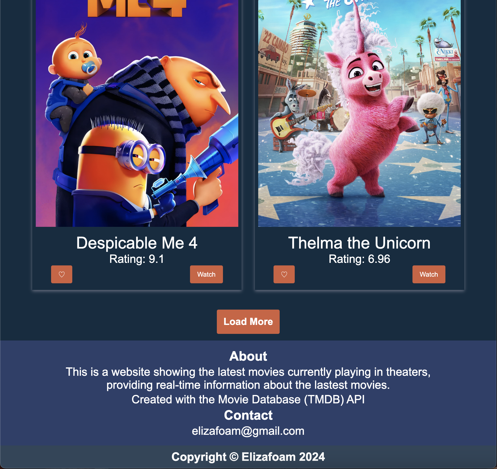

## Unit Assignment: Flixster

Submitted by: **Elizabeth Johnson**

Estimated time spent: **20** hours spent in total

### Application Features

#### CORE FEATURES

- [X] **Display Movies**
  - [X] Users can view a list of current movies from The Movie Database API.
  - [X] For each movie displayed, users can see its title, poster image, and votes.
  - [X] Users can load more current movies by clicking a button at the bottom of the list (page should not be reloaded).
- [X] **Search Functionality**
  - [X] Users can search for movies and view the results in a grid.
  - [X] Users can clear results and view previous current movies displayed.
- [X] **Accessibility Features**
  - [X] Website implements accessibility features (semantic HTML, color contrast, font sizing, alt text for images).
- [X] **Responsive Design**
  - [X] Website implements responsive web design.
- [X] **Movie Details**
  - [X] Users can view more details about a movie in a popup, such as runtime in minutes, backdrop poster, release date, genres, and/or an overview.
- [X] **Sorting Options**
  - [X] Users can click on a filter by drop down to sort product by type (alphabetic, release date, rating).
- [X] **Layout**
  - [X] Website displays header, banner, search, movie grid, about, contact, and footer section.

#### STRETCH FEATURES

- [ ] **Deployment**
  - [ ] Website is deployed via Render.
- [X] **Embedded Movie Trailers**
  - [X] Within the popup displaying a movie's details, users can play the movie trailer.
- [X] **Watched Checkbox**
  - [X] For each movie displayed, users can mark the movie as watched.
- [X] **Favorite Button**
  - [X] For each movie displayed, users can favorite the movie.
- [ ] **Sidebar**
  - [ ] Users can open a sidebar
  - [ ] The sidebar displays the user's favorited and watched movies

### Walkthrough Video

### Reflection

* Did the topics discussed in your labs prepare you to complete the assignment? Be specific, which features in your weekly assignment did you feel unprepared to complete?

    - Yes but more review with the fetch stuff would be good

* If you had more time, what would you have done differently? Would you have added additional features? Changed the way your project responded to a particular event, etc.
  
    - I would add more features and deploy the project. 

* Reflect on your project demo, what went well? Were there things that maybe didn't go as planned? Did you notice something that your peer did that you would like to try next time?

    - Overall it went well but I could use up all the time which would be good

### Open-source libraries used

    - Used TMDB API

### Shout out

Give a shout out to somebody from your cohort that especially helped you during your project. This can be a fellow peer, instructor, TA, mentor, etc.
